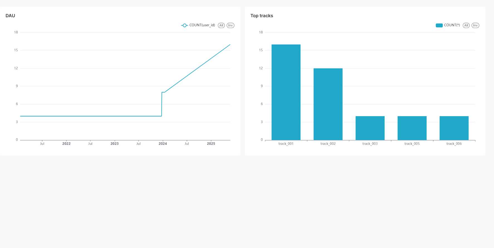

# ETL Pipeline with PostgreSQL, Debezium, Kafka, Spark и ClickHouse

Реализация ETL-пайплайна для обработки данных в реальном времени с использованием:

- **PostgreSQL** - источник данных
- **Debezium** - CDC (Change Data Capture)
- **Kafka** - потоковый брокер
- **Spark Structured Streaming** - обработка данных
- **ClickHouse** - аналитическая СУБД
- **Superset** - платформа для визуализации данных

## Предварительные требования

- Docker 20.10+
- Docker Compose 2.20+
- 4 ГБ свободной оперативной памяти
- Порты 5432, 9092, 8083, 8123, 8080 свободны

## Запуск проекта

1. Клонировать репозиторий:
```bash
git clone https://github.com/yourusername/etl5.git
```
2. Перейти в каталог
```bash
cd etl5
```
3. Запустить все сервисы:
```bash
docker-compose up -d
```
4. Запускаем spark
```bash
docker exec -it etl5-spark-master-1 spark-submit --packages org.apache.spark:spark-sql-kafka-0-10_2.12:3.5.0 /app/main.py
```

5. Загрузим зависимости
```bash
pip install -r requirements.txt
```

6. Запустим ex.py
```bash
python ex.py
```

## Проверка работы

1. Вставить тестовые данные в PostgreSQL:

```bash
docker exec -it etl5-postgres-1 psql -U user -d mydb


INSERT INTO messages (user_id, track_id, genre, artists, timestamp)
VALUES 
(1, 'track_001', ARRAY['pop', 'electronic'], ARRAY['ArtistA', 'ArtistB'], NOW()),
(2, 'track_002', ARRAY['rock', 'metal'], ARRAY['BandX', 'BandY'], NOW());
```

```bash
INSERT INTO messages (user_id, track_id, genre, artists, timestamp)
VALUES 
(1, 'track_058', ARRAY['pop', 'electronic'], ARRAY['ArtistA', 'ArtistB'], '2023-04-18 15:31:45'),
(2, 'track_056', ARRAY['rock', 'metal'], ARRAY['BandX', 'BandY'], '2023-10-29 23:59:59'),
(3, 'track_044', ARRAY['jazz', 'electronic'], ARRAY['ArtistA', 'ArtistB'], '2025-01-15 08:35:45'),
(6, 'track_055', ARRAY['pop'], ARRAY['ArtistA', 'ArtistB'], '2023-11-15 08:30:45'),
(5, 'track_049', ARRAY['pop', 'electronic'], ARRAY['ArtistA', 'ArtistB'], '2021-06-10 16:30:45'),
(9, 'track_096', ARRAY['pop', 'electronic'], ARRAY['ArtistA', 'ArtistB'], '2022-10-11 12:30:45'),
(11, 'track_098', ARRAY['electronic'], ARRAY['ArtistA', 'ArtistB'], '2024-01-15 08:30:45'),
(13, 'track_099', ARRAY['pop', 'electronic'], ARRAY['ArtistC'], '2021-03-15 08:30:45'),
(14, 'track_019', ARRAY['pop', 'jazz'], ARRAY['ArtistD', 'ArtistB'], '2025-04-15 09:30:45'),
(15, 'track_008', ARRAY['pop', 'electronic'], ARRAY['ArtistA', 'ArtistD'], '2025-04-15 06:30:45'),
(1, 'track_007', ARRAY['pop', 'electronic'], ARRAY['ArtistA', 'ArtistB'], '2025-04-15 05:30:45'),
(2, 'track_005', ARRAY['pop', 'electronic'], ARRAY['ArtistV', 'ArtistB'], '2025-05-15 15:30:45'),
(3, 'track_0014', ARRAY['hip hop', 'electronic'], ARRAY['ArtistS', 'ArtistF'], '2021-06-15 19:30:45'),
(16, 'track_0013', ARRAY['pop', 'electronic'], ARRAY['ArtistA', 'ArtistB'], '2024-07-15 19:30:45'),
(17, 'track_0011', ARRAY['pop', 'rap'], ARRAY['ArtistA', 'ArtistB'], '2024-08-15 20:30:45'),
(8, 'track_0046', ARRAY['rap'], ARRAY['ArtistA', 'ArtistB'], '2024-09-15 21:30:45'),
(7, 'track_0068', ARRAY['pop', 'electronic'], ARRAY['ArtistA', 'ArtistB'], '2024-02-15 22:30:45'),
(1, 'track_0026', ARRAY['rap', 'electronic'], ARRAY['ArtistA', 'ArtistC'], '2025-03-15 19:30:45'),
(3, 'track_0030', ARRAY['electronic'], ARRAY['ArtistA', 'ArtistB'], '2023-04-15 16:30:45'),
(4, 'track_0045', ARRAY['pop', 'electronic'], ARRAY['ArtistN', 'ArtistV'], '2024-05-15 22:30:45'),
(1, 'track_0011', ARRAY['electronic'], ARRAY['ArtistA', 'ArtistE'], '2025-11-15 21:30:45'),
(1, 'track_004', ARRAY['rock', 'metal'], ARRAY['BandE', 'BandY'], '2025-12-25 23:59:59');
```

2. Проверить данные в ClickHouse:

```bash
docker exec -it etl5-clickhouse-1 clickhouse-client

SELECT * FROM test.messages
```

Ожидаемый вывод:
```
┌─user_id─┬─track_id──┬─genre──────┬─artist──┬───────────timestamp─┐
│       1 │ track_001 │ pop        │ ArtistA │ 2025-05-24 17:17:45 │
│       1 │ track_001 │ pop        │ ArtistB │ 2025-05-24 17:17:45 │
│       1 │ track_001 │ electronic │ ArtistA │ 2025-05-24 17:17:45 │
│       1 │ track_001 │ electronic │ ArtistB │ 2025-05-24 17:17:45 │
│       2 │ track_002 │ rock       │ BandX   │ 2025-05-24 17:17:45 │
│       2 │ track_002 │ rock       │ BandY   │ 2025-05-24 17:17:45 │
│       2 │ track_002 │ metal      │ BandX   │ 2025-05-24 17:17:45 │
│       2 │ track_002 │ metal      │ BandY   │ 2025-05-24 17:17:45 │
└─────────┴───────────┴────────────┴─────────┴─────────────────────┘


```
3. Можно перейти по http://localhost:8088

4. Логинимся

Вводим:

```
Login: admin

Password: admin
```
5. Создаём подключение

Вводим:

```
HOST: clickhouse

PORT: 8123

Database name: test

USERNAME: default

Password: (пусто)

Display name: ClickHouse Test
```

6. Создаём dashboard

*В верхнем чаре можно подвигать ползунок и поменять YAU на MAU, DAU*



## Архитектура
```
PostgreSQL → (Debezium) → Kafka → Spark Streaming → ClickHouse -> Superset
```


7. Ещё примеры данных

(1, 'test_track', ARRAY['pop', 'rock'], ARRAY['Artist1', 'Artist2'], NOW())
event-type:UserRegistered;{"user_id":"user123","email":"user@example.com","username":"new_user","timestamp":"2025-05-24T17:17:45"}
{"event_type": "SessionStarted", "session_id": "session_abc", "user_id": "user123", "track_id": "track_001", "bitrate": "320kbps", "timestamp": "2025-05-24T17:18:00"}

UserRegistered:

text
Заголовок: event-type: UserRegistered
Тело: {"user_id": "user123", "email": "user@example.com", "username": "new_user", "timestamp": "2025-05-24T17:17:45"}
SessionStarted:

text
event-type:SessionStarted;{"session_id":"session_abc","user_id":"user123","track_id":"track_001","bitrate":"320kbps","timestamp":"2025-05-24T17:18:00"}
BitrateChangedEvent:

text
{"event_type": "BitrateChangedEvent", "session_id": "session_abc", "new_bitrate": 256, "timestamp": "2025-05-24T17:19:30"}
ChunksAckEvent:

text
{"type": "ChunksAckEvent", "session_id": "session_abc", "acked_chunk_count": 100, "timestamp": "2025-05-24T17:20:00"}
SessionPaused:

text
event-type:SessionPaused;{"session_id":"session_abc","timestamp":"2025-05-24T17:21:00"}
SessionResumed:

text
event-type:SessionResumed;{"session_id":"session_abc","timestamp":"2025-05-24T17:22:00"}
SessionStopped:

text
{"event_type": "SessionStopped", "session_id": "session_abc", "total_chunks_sent": 500, "timestamp": "2025-05-24T17:25:00"}
OffsetChangedEvent:

text
event-type:OffsetChangedEvent;{"session_id":"session_abc","new_chunk_offset":300,"old_chunk_offset":200,"timestamp":"2025-05-24T17:23:00"}
TrackAddedToPlaylist:

text
{"type": "TrackAddedToPlaylist", "playlist_id": 5, "track_id": 10, "user_id": 1, "timestamp": "2025-05-24T17:24:00"}
Старый формат:

text
(3, 'classic_track', ARRAY['classical'], ARRAY['Composer1'], '2025-05-25 11:00:00')

8. Инициализировать таблицы в постгресс


kafka-console-consumer --bootstrap-server localhost:9092 --topic pgserver.public.messages --from-beginning


9.C:\Users\79853\Desktop\audio_service\audio_service_project>docker-compose exec kafka kafka-console-producer.sh --bootstrap-server kafka:9092 --topic etl-topic 
>(1, 'test_track', ARRAY['pop', 'rock'], ARRAY['Artist1', 'Artist2'], NOW())
>
>(1, 'test_track', ARRAY['pop', 'rock'], ARRAY['Artist1', 'Artist2'], NOW())
>(1, 'test_track', ARRAY['pop', 'rock'], ARRAY['Artist1', 'Artist2'], NOW())
>(1, 'test_track', ARRAY['pop', 'rock'], ARRAY['Artist1', 'Artist2'], NOW())
>(1, 'test_track', ARRAY['pop', 'rock'], ARRAY['Artist1', 'Artist2'], NOW())
>(1, 'test_track', ARRAY['pop', 'rock'], ARRAY['Artist1', 'Artist2'], NOW())
>(1, 'test_track', ARRAY['pop', 'rock'], ARRAY['Artist1', 'Artist2'], NOW())
>(1, 'test_track', ARRAY['pop', 'rock'], ARRAY['Artist1', 'Artist2'], NOW())
>(1, 'test_track', ARRAY['pop', 'rock'], ARRAY['Artist1', 'Artist2'], NOW())
>(1, 'test_track', ARRAY['pop', 'rock'], ARRAY['Artist1', 'Artist2'], NOW())
>UserRegistered
>event-type: UserRegistered
>event-type:UserRegistered
>event-type: UserRegistered
>event-type:UserRegistered;{"user_id":"user123","email":"user@example.com","username":"new_user","timestamp":"2025-05-24T17:17:45"}
>event-type:UserRegistered;{"user_id":"user123","email":"user@example.com","username":"new_user","timestamp":"2025-05-24T17:17:45"}
>{"event_type": "SessionStarted", "session_id": "session_abc", "user_id": "user123", "track_id": "track_001", "bitrate": "320kbps", "timestamp": "2025-05-24T17:18:00"}
>{"event_type": "SessionStarted", "session_id": "session_abc", "user_id": "user123", "track_id": "track_001", "bitrate": "320kbps", "timestamp": "2025-05-24T17:18:00"}
>event-type:UserRegistered;{"user_id":"user123","email":"user@example.com","username":"new_user","timestamp":"2025-05-24T17:17:45"}
>{"event_type": "SessionStarted", "session_id": "session_abc", "user_id": "user123", "track_id": "track_001", "bitrate": "320kbps", "timestamp": "2025-05-24T17:18:00"}
>(1, 'test_track', ARRAY['pop', 'rock'], ARRAY['Artist1', 'Artist2'], NOW())
>(1, 'test_track', ARRAY['pop', 'rock'], ARRAY['Artist1', 'Artist2'], NOW())
>(1, 'test_track', ARRAY['pop', 'rock'], ARRAY['Artist1', 'Artist2'], NOW())
>{"event_type": "SessionStarted", "session_id": "session_abc", "user_id": "user123", "track_id": "track_001", "bitrate": "320kbps", "timestamp": "2025-05-24T17:18:00"}
>(1, 'test_track', ARRAY['pop', 'rock'], ARRAY['Artist1', 'Artist2'], NOW())
>
>(1, 'test_track', ARRAY['pop', 'rock'], ARRAY['Artist1', 'Artist2'], NOW())
>(1, 'test_track', ARRAY['pop', 'rock'], ARRAY['Artist1', 'Artist2'], NOW())
>(1, 'test_track', ARRAY['pop', 'rock'], ARRAY['Artist1', 'Artist2'], NOW())
>{"event_type": "SessionStarted", "session_id": "session_abc", "user_id": "user123", "track_id": "track_001", "bitrate": "320kbps", "timestamp": "2025-05-24T17:18:00"}
>(1, 'test_track', ARRAY['pop', 'rock'], ARRAY['Artist1', 'Artist2'], NOW())
>{"event_type": "SessionStarted", "session_id": "session_abc", "user_id": "user123", "track_id": "track_001", "bitrate": "320kbps", "timestamp": "2025-05-24T17:18:00"}
>{"event_type": "SessionStarted", "session_id": "session_abc", "user_id": "user123", "track_id": "track_001", "bitrate": "320kbps", "timestamp": "2025-05-24T17:18:00"}
>event-type:UserRegistered;{"user_id":"user123","email":"user@example.com","username":"new_user","timestamp":"2025-05-24T17:17:45"}
>event-type:UserRegistered;{"user_id":"user123","email":"user@example.com","username":"new_user","timestamp":"2025-05-24T17:17:45"}
>{"type": "TrackAddedToPlaylist", "playlist_id": 5, "track_id": 10, "user_id": 1, "timestamp": "2025-05-24T17:24:00"}
>{"type": "TrackAddedToPlaylist", "playlist_id": 5, "track_id": 10, "user_id": 1, "timestamp": "2025-05-24T17:24:00"}
>(1, 'test_track', ARRAY['pop', 'rock'], ARRAY['Artist1', 'Artist2'], NOW())
>{"type": "TrackAddedToPlaylist", "playlist_id": 5, "track_id": 10, "user_id": 1, "timestamp": "2025-05-24T17:24:00"}
>
